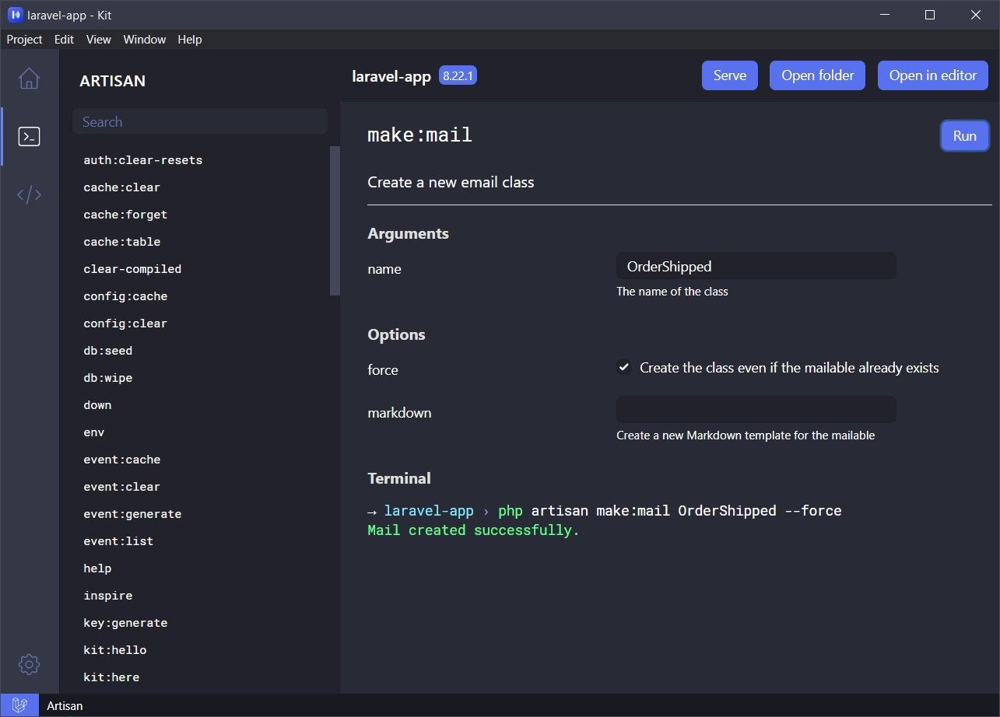

A simple and elegant desktop application for managing your Laravel applications.<br>

Available for Windows, Linux and macOS.

## Features

- No configuration required.
- Execute Artisan commands easily in a nice interface.
- Tinker with your project in a magical code editor.
- Serve your Laravel application locally with a click of a button (so convenient 🤩).
- Beautiful user interface inspired by VSCode and dark theme.
- Artisan commands are retrieved from your Laravel project.

## Installation

PHP must be installed in your system.

### Windows

[Download the setup file (.exe)](https://github.com/tmdh/laravel-kit/releases/latest) and install it. Updates will be checked automatically.

### macOS

The recommended way to install on macOS is by using [brew](https://brew.sh/).

```
brew install laravel-kit --no-quarantine
```

Or, you can download the dmg file from the [Releases](https://github.com/tmdh/laravel-kit/releases/latest) page. Note that the dmg release is not code signed. [Installation instructions for dmg](https://github.com/tmdh/laravel-kit/issues/40#issuecomment-1085726076)

### Ubuntu and other derivatives

Run these commands from the terminal:

```
wget https://github.com/tmdh/laravel-kit/releases/download/v2.0.8/laravel-kit_2.0.8_amd64.deb
sudo apt install ./laravel-kit_2.0.8_amd64.deb
```

### Arch Linux

It is available in the Arch User Repository (AUR) as [laravel-kit](https://aur.archlinux.org/packages/laravel-kit).

### Other Linux distributions

Only AppImage format is available for other Linux distributions. Download it from the [Releases](https://github.com/tmdh/laravel-kit/releases/latest) page. Proper methods will be added very soon.

## Screenshots


## Development

Laravel Kit is made with [Electron](https://electronjs.org), [Vue.js 2](https://vuejs.org), [Tailwind CSS](https://tailwindcss.com) and [Vite](https://vitejs.dev).

```bash
# For development,
# Start development server with Vite
yarn run dev:one
# Start Electron
yarn run dev:two

# For production,
# Build files with Vite
yarn run prod
# Make executable
yarn run pack
```

## Documentation

Go to [Laravel Kit wiki](https://github.com/tmdh/laravel-kit/wiki).

---

Copyright © 2018-2022 by [Tareque Md Hanif](https://github.com/tmdh)
